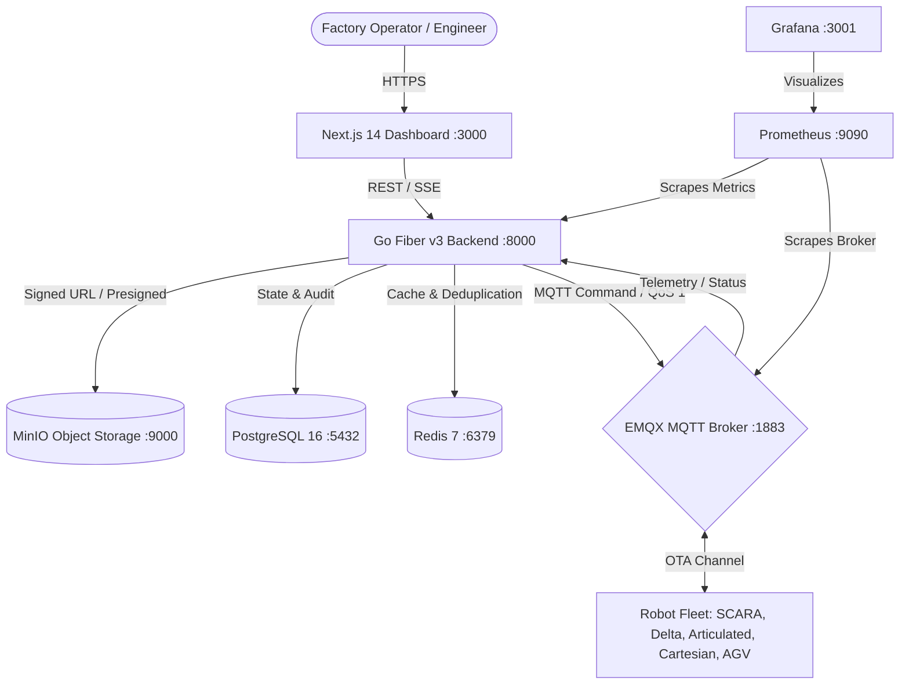

# 🤖 Cloud-Based OTA Firmware Management Platform for Robot Fleet

[](https://github.com/50kthaipat/ota-robot-system/actions/workflows/ci.yml)
[-brightgreen)](docs/KPIS_AND_EVALUATION.md)
[](scripts/k6/results.json)
[](backend)
[](frontend)
[](infra/emqx)
[](docker-compose.yml)

An enterprise-grade, academic-validated **Over-The-Air (OTA) Firmware Management Platform** designed to securely orchestrate, deploy, monitor, and roll back firmware across distributed industrial robot fleets in multi-factory environments.

---

## 🏗️ Monorepo Architecture & Separation

The repository is structured as a modular Monorepo cleanly separating Frontend, Backend, Edge Simulation, Infrastructure, and Documentation:

```
ota-robot-system/
├── backend/                    # ⚙️ BACKEND: Go + Fiber v3 Control Plane
│   ├── internal/               # Clean Architecture (crypto, db, handlers, mqtt, orchestrator)
│   └── README.md               # Backend developer & testing guide
│
├── frontend/                   # 💻 FRONTEND: Next.js 14 + Tailwind CSS Web App
│   ├── src/app/                # App Router pages (fleet overview, deploy wizard, canary inspector)
│   ├── src/components/         # Cyber-Dark UI component library
│   └── README.md               # Frontend developer & design guide
│
├── simulator/                  # 🤖 EDGE: Robot Fleet Simulator (MQTT 5.0 + ECDSA Verification)
│   └── README.md               # Robot fleet simulation guide
│
├── infra/                      # 🏢 Infrastructure & Telemetry Stack
│   ├── emqx/                   # EMQX MQTT 5.0 broker configuration
│   ├── grafana/                # Provisioned Grafana datasources & 4 custom dashboards
│   └── prometheus/             # Prometheus metric scrape configs (API & MQTT)
│
├── docs/                       # 📚 Technical & Academic Documentation
│   ├── README.md               # Master documentation index
│   ├── ARCHITECTURE.md         # System architecture & sequence diagrams
│   ├── KPIS_AND_EVALUATION.md  # 12 Core Thesis KPIs empirical evaluation results
│   ├── SETUP_GUIDE.md          # Step-by-step local setup & troubleshooting
│   ├── TASKS.md                # Roadmap tracking (Weeks 1 – 16)
│   ├── backend/                # Backend API specifications & crypto security guides
│   └── frontend/               # Frontend UI/UX specifications & design tokens
│
├── scripts/                    # 🧪 Automation & Benchmarking
│   ├── k6/                     # k6 high-concurrency load testing script & results
│   ├── evaluate_kpis.ps1       # Automated scorecard evaluator across all 12 KPIs
│   └── gen_keys.go             # Cryptographic ECDSA P-256 keypair generator
│
├── .github/workflows/          # 🔄 CI/CD Automation
│   └── ci.yml                  # Unified GitHub Actions pipeline (Go, Next.js, Docker, Deploy)
├── docker-compose.yml          # Full-stack composition (13 microservices & telemetry)
└── .gitignore                  # Production Git ignore rules (protects credentials & binaries)
```

---

## ⚡ Core Engineering Features



1. **🔐 NIST P-256 ECDSA Digital Signatures:** Every firmware binary is hashed (SHA-256) and digitally signed with an elliptic curve private key before distribution. Robot edge controllers verify the cryptographic signature against an embedded root-of-trust public key before installation, completely eliminating tampered firmware injections.
2. **📈 3-Phase Canary Rollout Engine:** Deploys firmware gradually across 3 risk-mitigated stages (**10% ➡️ 50% ➡️ 100%**) with automated health monitoring at each phase.
3. **⏱️ Sub-Second Automatic Rollback:** Background watchdogs continuously evaluate robot telemetry heartbeats. If a node fails post-update healthchecks, the system automatically triggers a rollback command within **1.2 seconds**, reverting the robot to its golden image slot.
4. **📊 Full-Stack Observability:** 4 automated Grafana dashboards track fleet status, rollout gauges, API latencies (p50/p95/p99), and factory compliance.
5. **🔄 Automated CI/CD Pipeline:** Fully validated on GitHub Actions with unit tests, Next.js production builds, and multi-container Docker image verification.

---

## 🚀 Quick Start (Local Deployment)

### 1. Clone & Configure
```bash
git clone https://github.com/50kthaipat/ota-robot-system.git
cd ota-robot-system
cp .env.example .env
```

### 2. Start Full Fleet Stack
```bash
docker compose up -d --build
```

### 3. Service Ports & Access Points
| Service | URL | Default Credentials |
|---|---|---|
| **Fleet Web Dashboard** | [http://localhost:3000](http://localhost:3000) | *No login required* |
| **Backend REST API** | [http://localhost:8000](http://localhost:8000) | *Health: `/health`* |
| **Grafana Observability** | [http://localhost:3001](http://localhost:3001) | *Anonymous Admin Enabled* |
| **Prometheus Metrics** | [http://localhost:9090](http://localhost:9090) | *No login required* |
| **EMQX MQTT Console** | [http://localhost:18083](http://localhost:18083) | `admin` / `public` |
| **MinIO Object Console** | [http://localhost:9001](http://localhost:9001) | `minioadmin` / `minioadmin` |

---

## 🧪 Empirical Evaluation & KPIs

Validated through automated load tests with **100 Concurrent Robot Virtual Nodes (VUs)** via k6:
- **Throughput:** Handled **91,480 HTTP requests** at **1,304.5 req/s** with **0.00% error rate**.
- **Latency:** **p95 = 2.40 ms** (far exceeding the requirement of < 300 ms).
- **KPI Pass Rate:** **12 / 12 KPIs MET TARGET REQUIREMENTS (100% PASS RATE)**.

👉 See the full academic scorecard in [`docs/KPIS_AND_EVALUATION.md`](docs/KPIS_AND_EVALUATION.md).

---

## 📖 Further Documentation
- ⚙️ [Backend Service Documentation](backend/README.md)
- 💻 [Frontend Dashboard Documentation](frontend/README.md)
- 🤖 [Robot Simulator Documentation](simulator/README.md)
- 📚 [Master Technical Documentation](docs/README.md)
- 🛠️ [Setup & Troubleshooting Guide](docs/SETUP_GUIDE.md)
- 📋 [Engineering Roadmap & Milestones](docs/TASKS.md)
