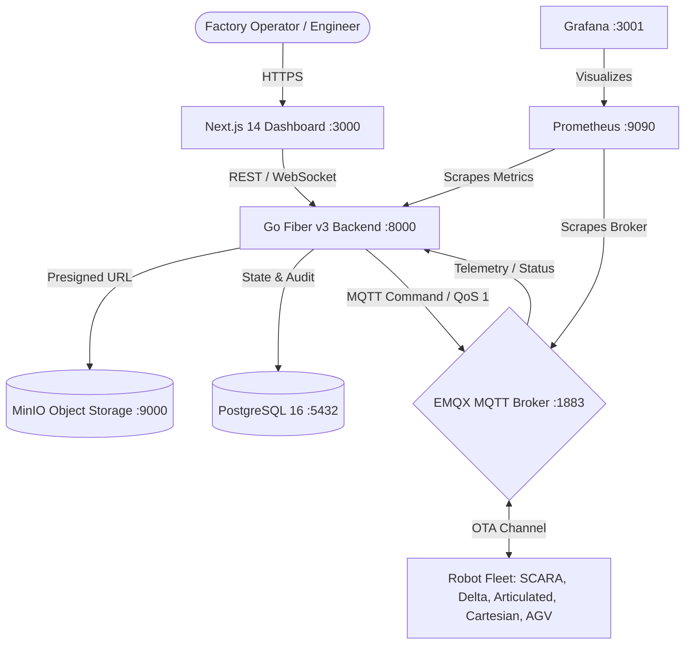

# Cloud-Based OTA Firmware Management Platform for Robot Fleet


An enterprise-grade, academic-validated **Over-The-Air (OTA) Firmware Management Platform** designed to securely orchestrate, deploy, monitor, and roll back firmware across distributed industrial robot fleets in multi-factory environments.

---

## 1. Monorepo Architecture & Separation

The repository is structured as a modular Monorepo cleanly separating Frontend, Backend, Edge Simulation, Infrastructure, and Documentation:

```
ota-robot-system/
├── backend/                    # BACKEND: Go + Fiber v3 Control Plane
│   ├── internal/               # Clean Architecture (crypto, db, handlers, mqtt, orchestrator)
│   └── README.md               # Backend developer & testing guide
│
├── frontend/                   # FRONTEND: Next.js 14 + Tailwind CSS Web App
│   ├── src/app/                # App Router pages (fleet overview, deploy wizard, canary inspector)
│   ├── src/components/         # Cyber-Dark UI component library
│   └── README.md               # Frontend developer & design guide
│
├── simulator/                  # EDGE: Robot Fleet Simulator (MQTT 5.0 + ECDSA Verification)
│   └── README.md               # Robot fleet simulation guide
│
├── infra/                      # Infrastructure & Telemetry Stack
│   ├── emqx/                   # EMQX MQTT 5.0 broker configuration
│   ├── grafana/                # Provisioned Grafana datasources & 4 custom dashboards
│   └── prometheus/             # Prometheus metric scrape configs (API & MQTT)
│
├── docs/                       # Technical & Academic Documentation
│   ├── README.md               # Master documentation index
│   ├── academic/               # Academic thesis specifications (Proposal & Experimental Plan)
│   ├── design/                 # Architecture, API & MQTT specs, Database schema, Crypto
│   └── operations/             # Local Docker setup, Cloud deploy guide, Tasks roadmap
│
├── scripts/                    # Automation & Benchmarking
│   ├── k6/                     # k6 load testing script & results
│   ├── run_experiments.ps1     # Automated runner across all 5 empirical scenarios
│   ├── statistical_analysis.py # Statistical testing script (Shapiro-Wilk, Mann-Whitney U)
│   └── gen_keys.go             # Cryptographic ECDSA P-256 keypair generator
│
├── .github/workflows/          # CI/CD Automation
│   └── ci.yml                  # Unified GitHub Actions pipeline (Go, Next.js, Docker, Deploy)
├── docker-compose.yml          # Full-stack composition
└── .gitignore                  # Production Git ignore rules
```

---

## 2. Core Engineering Features



1. **NIST P-256 ECDSA Digital Signatures:** Every firmware binary is hashed (SHA-256) and digitally signed with an elliptic curve private key before distribution. Robot edge controllers verify the cryptographic signature against an embedded root-of-trust public key before installation, preventing tampered firmware injections.
2. **3-Phase Canary Rollout Engine:** Deploys firmware gradually across 3 risk-mitigated stages (**20% -> 60% -> 100%**) with automated health monitoring at each phase.
3. **Automated Rollback Mechanism:** Background watchdogs continuously evaluate robot telemetry heartbeats. If a node reports failures or fails post-update healthchecks, the system automatically triggers a rollback command, reverting the robot to its golden image.
4. **Full-Stack Observability:** 4 automated Grafana dashboards track fleet status, rollout gauges, API latencies (p50/p95/p99), and factory compliance.
5. **Automated CI/CD Pipeline:** Fully validated on GitHub Actions with unit tests, Next.js production builds, and multi-container Docker image verification.

---

## 3. Quick Start (Local Deployment)

### Step 1: Configure Environment
```bash
cp .env.example .env
```

### Step 2: Start Full Fleet Stack
```bash
docker compose up -d --build
```

### Step 3: Service Ports & Access Points
| Service | URL | Default Credentials |
|---|---|---|
| **Fleet Web Dashboard** | [http://localhost:3000](http://localhost:3000) | No login required |
| **Backend REST API** | [http://localhost:8000](http://localhost:8000) | Health: `/health` |
| **Grafana Observability** | [http://localhost:3001](http://localhost:3001) | Anonymous Admin Enabled |
| **Prometheus Metrics** | [http://localhost:9090](http://localhost:9090) | No login required |
| **EMQX MQTT Console** | [http://localhost:18083](http://localhost:18083) | `admin` / `public` |
| **MinIO Object Console** | [http://localhost:9001](http://localhost:9001) | `minioadmin` / `minioadmin` |

---

## 4. Empirical Evaluation & Research Methodology

The platform is evaluated across 5 operational scenarios ($N=290$ trials) to eliminate evaluation bias:
1. **Nominal Baseline:** Happy path verification and latency profiling ($N=30$).
2. **Security & Code Signing:** Rejection of unsigned, tampered, and forged binaries ($N=30$).
3. **Fault Injection & Auto-Rollback:** A/B benchmarking between Direct and Canary Rollout ($N=10$).
4. **Adverse Network Conditions:** Performance under 150–500ms latency and 0–10% packet loss ($N=90$).
5. **Cross-Hardware Compatibility:** Heterogeneous model compatibility enforcement ($N=130$).

See full methodology in [`docs/academic/EXPERIMENTAL_PLAN.md`](docs/academic/EXPERIMENTAL_PLAN.md).

---

## 5. Master Documentation Index

- [Master Documentation Hub](docs/README.md)
- [Academic Project Proposal](docs/academic/PROJECT_PROPOSAL.md)
- [Experimental Plan & Methodology](docs/academic/EXPERIMENTAL_PLAN.md)
- [System Architecture](docs/design/ARCHITECTURE.md)
- [API & MQTT Protocols Specification](docs/design/API_AND_MQTT_SPEC.md)
- [Database Schema & ERD](docs/design/DATABASE_SCHEMA.md)
- [Cryptographic Code Signing](docs/design/CRYPTO_SECURITY.md)
- [Frontend UI/UX Specification](docs/design/UI_UX_SPEC.md)
- [Local Setup Guide](docs/operations/SETUP_LOCAL.md)
- [Cloud Deployment Guide](docs/operations/SETUP_CLOUD.md)
- [Tasks & Execution Roadmap](docs/operations/TASKS_ROADMAP.md)
