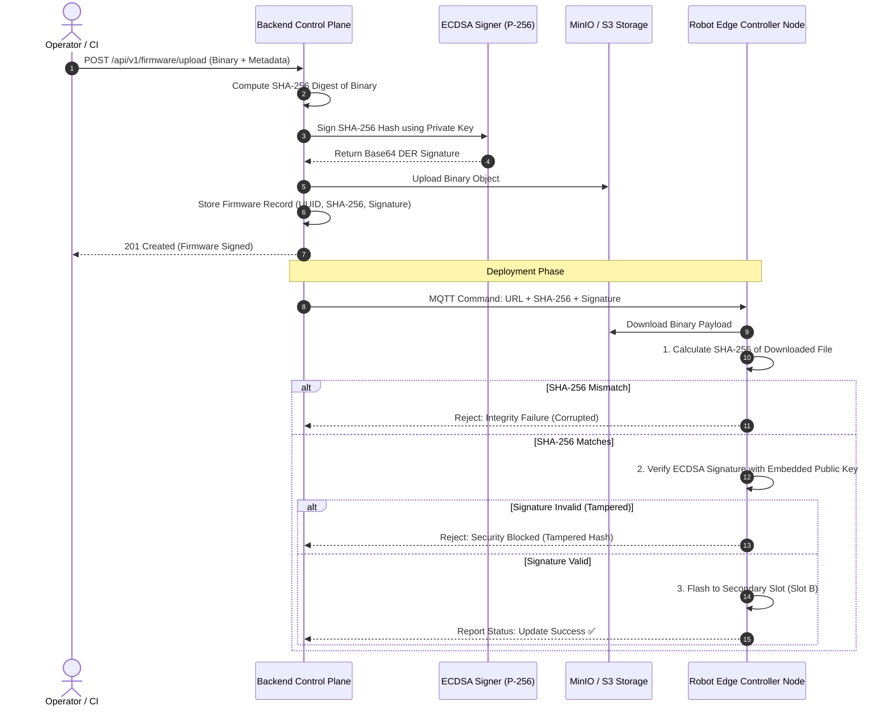

# 🔐 Cryptographic Code Signing & Security Architecture

[](https://csrc.nist.gov)
[](https://csrc.nist.gov)
[](#security-guarantees)

This document details the cryptographic verification pipeline implemented to secure firmware distribution against tampering, man-in-the-middle (MITM) attacks, and unauthorized malicious payload injections.

---

## 1. Threat Model & Security Guarantees

In an industrial multi-factory IoT deployment, firmware update channels face critical threats:
1. **Malicious Firmware Injection:** An adversary attempts to push modified bytecode to cause factory downtime or physical robot damage.
2. **Network Interception (MITM):** An adversary on the local plant network intercepts and alters firmware packets in transit.
3. **Replay Attacks:** Re-deploying an outdated, vulnerable firmware release.

### Core Defense: Asymmetric Cryptographic Code Signing
- **Private Key (`keys/private.pem`):** Kept strictly confidential on the secure Cloud Control Plane (never distributed to robots).
- **Public Key (`keys/public.pem`):** Embedded into robot controller hardware / simulator root of trust.

---

## 2. End-to-End Cryptographic Signing Flow



---

## 3. Implementation Details ([`services/api/internal/crypto/ecdsa.go`](../../services/api/internal/crypto/ecdsa.go))

### 3.1 Keypair Generation
Uses the NIST P-256 elliptic curve (`elliptic.P256()`) encoded in PKCS#8 / X.509 PEM format:
```go
func GenerateKeypair() (*ecdsa.PrivateKey, *ecdsa.PublicKey, error) {
    priv, err := ecdsa.GenerateKey(elliptic.P256(), rand.Reader)
    if err != nil {
        return nil, nil, err
    }
    return priv, &priv.PublicKey, nil
}
```

### 3.2 Digital Signing
```go
func SignHash(privateKey *ecdsa.PrivateKey, hash []byte) (string, error) {
    sig, err := ecdsa.SignASN1(rand.Reader, privateKey, hash)
    if err != nil {
        return "", err
    }
    return base64.StdEncoding.EncodeToString(sig), nil
}
```

### 3.3 Signature Verification
```go
func VerifySignature(publicKey *ecdsa.PublicKey, hash []byte, signatureBase64 string) bool {
    sigBytes, err := base64.StdEncoding.DecodeString(signatureBase64)
    if err != nil {
        return false
    }
    return ecdsa.VerifyASN1(publicKey, hash, sigBytes)
}
```

---

## 4. Empirical Test Verification

Unit tests in [`services/api/internal/crypto/ecdsa_test.go`](../../services/api/internal/crypto/ecdsa_test.go) verify:
1. Valid signatures pass verification with 100% reliability.
2. Signatures verified against an altered hash (tampered firmware) return `false` every single time.
3. Signatures generated with different keypairs fail verification.
