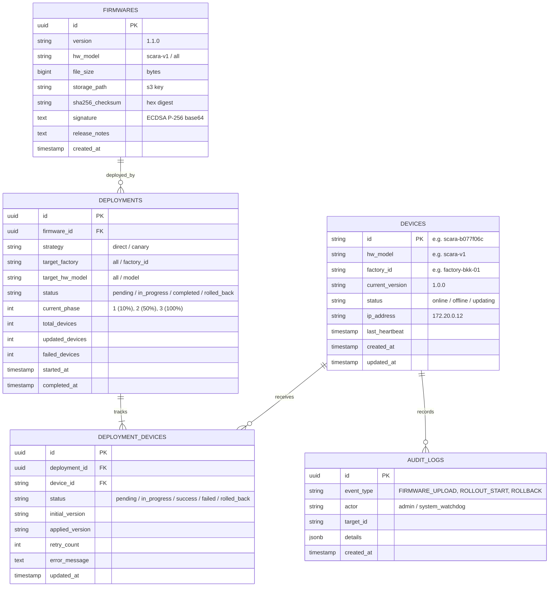

# 🗄️ PostgreSQL Database Schema & State Store

This document describes the relational database structure, indexing strategies, and entity relationships of the OTA platform.

---

## 1. Entity-Relationship Diagram (ERD)

---

## 2. Table Specifications

### 2.1 `devices`
Tracks all physical or simulated edge robot controllers.
- `id` (VARCHAR 64, PK)
- `hw_model` (VARCHAR 32, INDEXED)
- `factory_id` (VARCHAR 64, INDEXED)
- `current_version` (VARCHAR 32)
- `status` (VARCHAR 16) - `online`, `offline`, `updating`
- `last_heartbeat` (TIMESTAMPTZ, INDEXED)

### 2.2 `firmwares`
Immutable ledger of signed firmware binary images stored in MinIO/S3.
- `id` (UUID, PK)
- `version` (VARCHAR 32, UNIQUE with hw_model)
- `sha256_checksum` (CHAR 64)
- `signature` (TEXT) - NIST P-256 DER encoded in Base64
- `storage_path` (VARCHAR 255)

### 2.3 `deployments` & `deployment_devices`
Tracks multi-phase rollout lifecycles and per-robot execution states:
- Handles canary progression (10% ➡️ 50% ➡️ 100%)
- Records precise update duration and automatic rollback trigger reasons.
