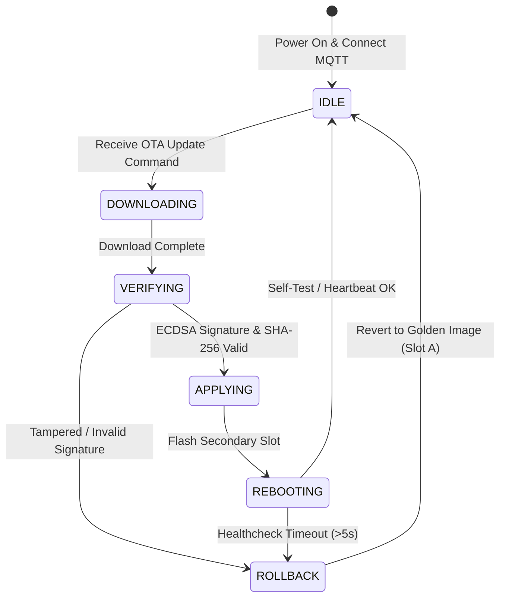

# OTA Robot Edge Simulator

[](https://golang.org)
[](https://mqtt.org)
[](#security-verification)

The **OTA Robot Edge Simulator** simulates industrial robot edge nodes (such as Cartesian, SCARA, Delta, Articulated, and AGV robots) deployed across multiple manufacturing facilities. Each simulator instance runs an autonomous OTA Agent that connects to the EMQX broker via MQTT 5.0, reports continuous heartbeats, downloads firmware updates, validates cryptographic digital signatures, and executes automatic rollbacks upon failure.

---

## 1. Architecture & State Machine

Each robot node executes a finite state machine mimicking actual embedded Linux / RTOS robot controllers with Dual-Slot (Slot A / Slot B) architecture:



---

## 2. Security Verification (ECDSA P-256)

When the simulator receives an update command from `ota/device/{device_id}/command`, it performs strict two-layer validation before applying:
1. **SHA-256 Integrity Check:** Calculates the hash of the downloaded firmware payload and verifies against `sha256_checksum`.
2. **NIST P-256 ECDSA Digital Signature Verification:** Decodes the base64 signature in `signature` and validates it against the embedded `public.pem` public key.
   - **Tampered Firmware Protection:** If an attacker tampers with even a single bit of the firmware binary or signature, verification fails immediately, installation is rejected, and an alert telemetry message is dispatched.

---

## 3. Running the Simulator

### Environment Variables
| Variable | Description | Example |
|---|---|---|
| `DEVICE_ID_PREFIX` | Prefix for generating unique robot ID | `scara` |
| `HW_MODEL` | Hardware robot model identifier | `scara-v1` |
| `FACTORY_ID` | Manufacturing plant code | `factory-bkk-01` |
| `MQTT_BROKER` | Address of EMQX broker | `tcp://localhost:1883` |
| `ECDSA_PUBLIC_KEY_PATH` | Path to public key for signature check | `./keys/public.pem` |

### Running a Single Robot
```bash
go run main.go
```

### Simulating a Fleet via Docker
To run multiple simulated robots across different factory sites:
```bash
# Handled automatically in docker-compose.yml:
# - robot-scara (Bangkok)
# - robot-delta (Rayong)
# - robot-articulated (Chonburi)
# - robot-cartesian (Ayutthaya)
# - robot-agv (Samut Prakan)
docker compose up -d robot-scara robot-delta robot-articulated robot-cartesian robot-agv
```
